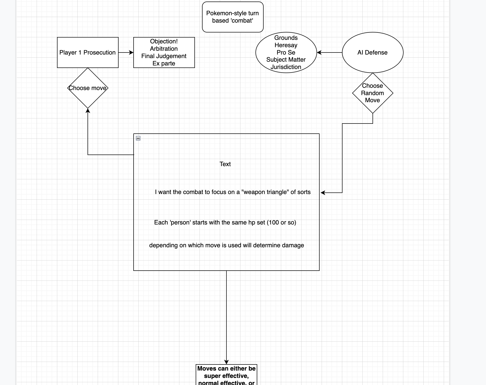

# OBJECTION! Hearsay

Another day in court! You are a high-profile prosecution attourney of Jones, Jones, Jones & Jones, PLLC. There has been a sudden increase in people who think they know the law better than you and have opted to forgo defense council and represent themselves in court, questioning the jurisdiction of the United States. Your role is to navigate nonsensical legal challenges in 1-on-1 legal combat and send these ne're-do-wells to jail! (Keep in mind, in keeping with the theme of the game, all defendants are considered guilty unless their legalese proves otherwise.)

## Stack
-Javascript 
-CSS 
-HTML 

## Wireframe

<!-- link to wireframe-->
[GoogleDoc](https://drive.google.com/file/d/1_e6nnaOROpv63PtRnpLa7HM7T-70Ed2R/view?usp=sharing)

## MVP Goals

-user can start a game against an AI 

-user can select 1 of 4 moves against AI opponent 

-AI opponent will use 1 of the 4 moves they have at random 

-Damage calculated to each opponent will be determined by 'weapon triangle' with stronger abilities being more effective against opposing abilities  

-declare winner after 1 player has gotten the opposing player to 0 hp 

-focus on random element of combat, player will not always win, should have a slight sense of chaos. 

## Stretch Goals

-Player can select different AI players to go against 

-Add epic battle music 

## Potential Roadblocks

-Since this is more of a weapon sqaure and not a triangle I may have some difficulty balacing combat (that may not be a bad thing since this is supposed to emulate chaotic court cases) 

-Make sure that the AI chooses random moves and does not favor moves that are super-effective against the user 

